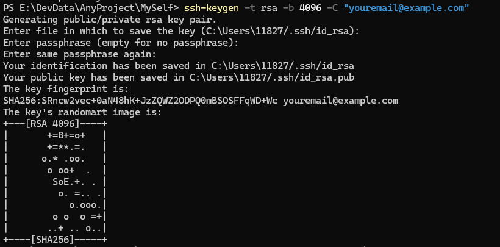
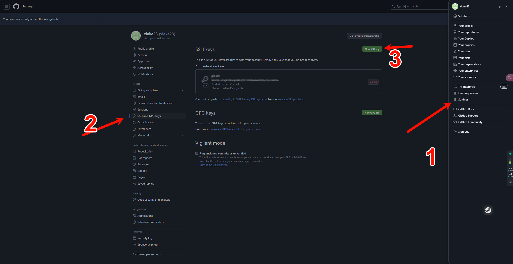
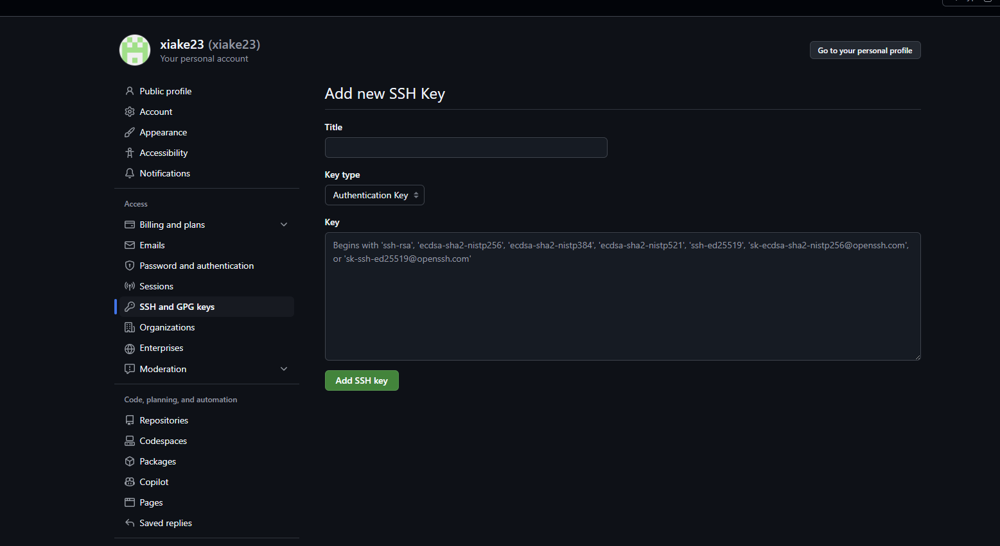
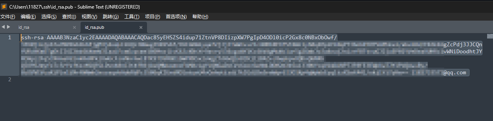
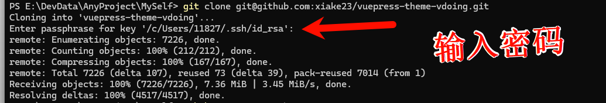
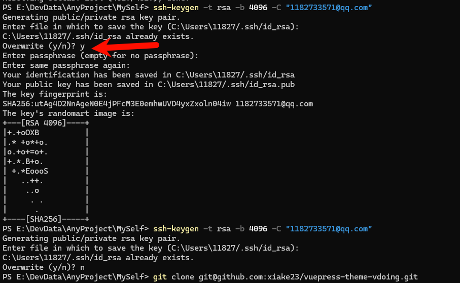
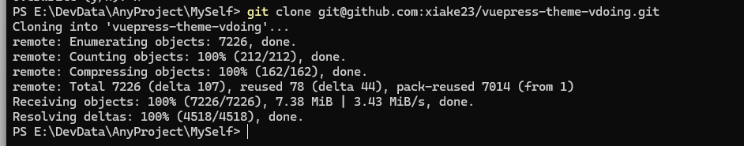

# github配置ssh连接

由于dns污染以及端口封禁等原因，有时候使用https方式拉取github的代码会报错，因此我们需要配置ssh链接方式，本文将记录如何通过ssh连接github。


## 一、ssh和https的关系

SSH（Secure Shell）和HTTPS（超文本传输安全协议）都是用于在网络中安全传输数据的协议，但它们在用途和实现上有所不同：

1. **用途**：
   - **SSH**：主要用于远程登录到服务器、执行命令、传输文件等。它提供了一个安全的通道，通过加密的方式保护数据传输过程中的隐私和完整性。
   - **HTTPS**：主要用于在浏览器和网站服务器之间安全地传输数据。它在HTTP协议的基础上增加了SSL/TLS协议，确保了数据传输的安全性。

2. **加密方式**：
   - **SSH**：使用公钥/私钥对进行身份验证和加密通信。用户拥有一对密钥，公钥存放在服务器上，私钥保存在本地。当用户尝试连接到服务器时，服务器会使用公钥加密一段数据发送给用户，用户使用私钥解密，以验证身份。
   - **HTTPS**：使用SSL/TLS协议进行加密。在建立连接时，服务器会向客户端发送其证书，客户端验证证书的有效性后，双方协商一个对称加密密钥，用于后续通信的加密和解密。

3. **端口**：
   - **SSH**：默认使用端口22。
   - **HTTPS**：使用端口443。

4. **应用场景**：
   - **SSH**：更多用于服务器管理、远程工作站访问、命令行操作等。
   - **HTTPS**：主要用于网站访问，确保用户与网站之间的交互安全，如登录、支付等。

5. **配置和使用**：
   - **SSH**：通常需要在服务器上配置SSH服务，并在客户端配置SSH客户端工具。
   - **HTTPS**：需要在服务器上配置SSL/TLS证书，并在浏览器中启用HTTPS。

尽管SSH和HTTPS在实现和应用上有所不同，但它们共同的目标是确保数据在网络中的安全传输。

> 以上内容为Kimi生成，经过本人过往经验，有时候443端口确实会因各种原因导致不能使用，使用ssl的22端口可以规避相关问题


## 二、安装Git

安装Git之后会自带 ssh-keygen 密钥生成器，后面我们会用到这一个工具，安装Git过程此处省略

## 三、生成SSH密钥

我们需要在电脑上生成SSH密钥，以便与Github进行通信，由于SSH使用公私钥对的非对称加密，当用户尝试连接到服务器时，服务器会使用公钥加密一段数据发送给用户，用户使用私钥解密，以验证身份。因此该SSH密钥是由我们生成后配置公钥到github账户设置中

```shell
ssh-keygen -t rsa -b 4096 -C "youremail@example.com"
```

使用SSH密钥生成器中，提示您输入文件名时，可以使用默认值(即 ~/.ssh/id_rsa)。



点击Enter键后，系统将提示您输入密码。如果您想留空密码，则只需输入两次Enter键即可。

密钥生成后可以在配置的目录下看到名为id_rsa.pub的公钥文件，里面的内容即为我们要配置到github账户设置中的公钥文本

## 四、github配置SSH公钥

打开github账户设置-SSH and gpg keys





key Type使用默认的认证密钥即可，key内容为刚才我们生成的公钥内容：




## 五、使用SSH方式拉取代码



由于我刚才生成密钥对文件时输入了密码，因此每次我使用该密钥対进行通信时都会验证密码，这一步建议在公用电脑上如此配置，如果没有严格的保密需求的话，可以在生成密钥文件时直接回车不使用密码，已经生成过的直接覆盖即可：



若没有使用密码，拉取代码时则会直接通过：

